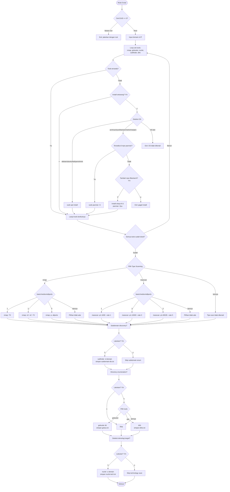

# List Tools Development Dari saya
## Tools ini Hanya di gunakan dengan beretika!
### ⚠️ Disclaimer
Tool ini dibuat untuk tujuan edukasi dan pentest yang **legal**.
Gunakan HANYA pada:
- Sistem milik sendiri
- Target dengan izin tertulis (scope/RoE jelas)
- Lab/platform resmi (TryHackMe, HTB, dll)

Penulis tidak bertanggung jawab atas penyalahgunaan tool ini.

## FlowChart

